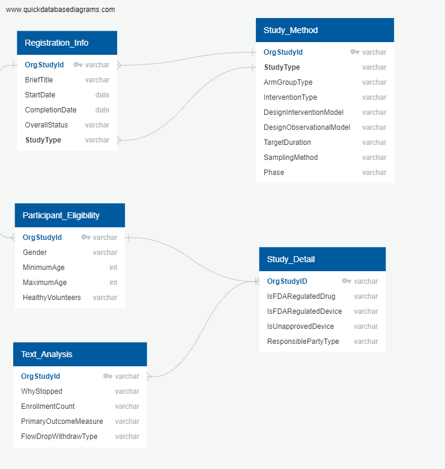

# Clinical Trials Research Project
## Topic Overview
This project analyzes clinical breast cancer research from the database of privately and publicly funded [clinical studies](https://clinicaltrials.gov/) provided by the U.S. National Library of Medicine. The aim of this project is to help cancer patients comprehend the clinical research landscape in order to understand the full breadth of their treatment options. This project builds off of existing [research on clinical trials](https://www.ncbi.nlm.nih.gov/pmc/articles/PMC6092479/) to discern the factors that make clinical trials successful or not. This project leverages machine learning to find patterns across the data and predict the status/outcome of a trial. 
 

While the purview of this project is restricted to clinical trials about breast cancer our hope is that this project can serve as a springboard for some type of consulting service for patients and clinical research coordinators alike. By providing primary stakeholders with data-driven insights into the clinical trial process, this project can enable researchers to maximize the likelihood of success, and empower patients to make the most educated decisions about their health. 
## Research Outline
1. Building the database 
The data for this project was pulled using the [clinicaltrials.gov API](https://clinicaltrials.gov/api/gui/home). Before cleaning the data there were 13,821 results for breast cancer trials. In order to organize the data-cleaning stage search fields are separated into tables made up primarily of categorical variables. These are: registration information, participant eligibility, study method, and study details. A fifth table made up of free-text response fields was pulled to conduct text analysis later in the machine learning phase. By running five discrete API calls, the data was segmented into the five tables seen in the image below. 
 
The Unique Protocol Identifiction Number(OrgStudyId) is the primary key for each table
2. Cleaning the data

