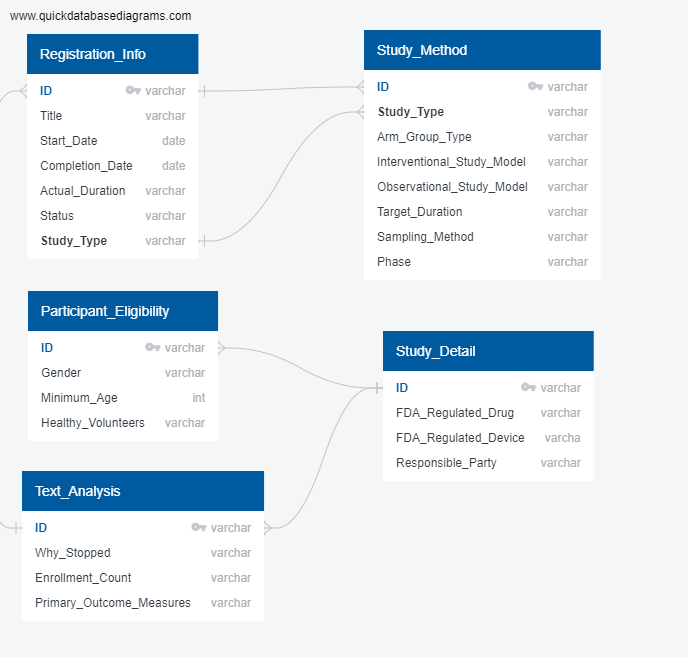

## Clinical Breast Cancer Research Trial 

## Topic Overview

&#9989; Topic and Reasoning<br>
The aim of the project is to help cancer patients comprehend the clinical research landscape in order to understand the full breadth of their treatment options. This project builds off of existing [research on clinical trials](https://www.ncbi.nlm.nih.gov/pmc/articles/PMC6092479/) to discern the factors that make clinical trials successful or not. The project also leverages machine learning to find patterns across the data and predict the status/outcome of a trial.<br>

&#9989; Questions aimed to answer <br>
Here are some questions that the project would aim to answer:
* What factors influence the likelihood of success? Are there measurable degrees of achievement?
* Would one type of trials be more successful than others?
* Is trial length associated with success?
* Would the number of paricipants affect the likelihood of success?
* Are certain trial phases associated with make-or-break points?
* What are the most commnon reasons that made the trial stop?

&#9989; Description of data source<br>
The data for this project was obtained through API from the database of privately and publicly funded [clinical studies](https://clinicaltrials.gov/) provided by the U.S. National Library of Medicine. For the purpose of our research, the data was limited to "Breast Cancer" and date range of 2018 and after (due to some report regulations changed).

While the purview of this project is restricted to clinical trials of breast cancer, this project can potentially serve as a springboard for a consulting services for patients and clinical research coordinators in the future. By providing primary stakeholders with data-driven insights into the clinical trial process, this project can enable researchers to maximize the likelihood of success, and empower patients to make the most educated decisions about their health.

## Research Outline

&#9989; Description of data exploration phase<br>
#### 1. Extract, Transfer, Load and Clean the data <br> 
(Please feel free to edit this Gahyun and Annekah)

*Progress Status*: All data was extracted from [clinicaltrials.gov API](https://clinicaltrials.gov/api/gui/home), cleaned and loaded into 5 [tables](https://github.com/AnneLonero/Clinical_Trials_Research_Project/tree/main/Tables).
Data extracted as json files from [clinicaltrials.gov API](https://clinicaltrials.gov/api/gui/home) were converted into multiple DataFrames for data cleaning. 
<br>
As shown above, all values in DataFrames were enclosed by ```[]``` brackets, which needed to be removed for data processing. All dataframes' values were first converted to string, then each values were run through ```for``` loops to remove the brackets through regular expression. All columns were then renamed. 

There also were some trials had multiple rows of data (duplicated ID's), which needed to be cleaned for our analysis purposed. Only the first rows of the duplicated ID numbers were kept using ```drop_duplicates(subset=[ID], keep='first')```.

We had to change the Start Date, Completion Date, and Actual Duration to datetime type. We had to also modify some of the variables, such as Intervention Type, Observation Study Model, and Arm Group Type to keep only the first provided response in order to create more streamlined visualizations. 


#### 2. Build Database<br>
*Progress Status*: Database finished with 5 tables. All the data was intergrated and ready for queries. SQL Queries ran to achieve multiple statistic analysis and created additional customed tables for future analysis.<br> 

The database was built in Postgre pgAdmin using 5 separate tables and used `ID` as primary key for each table (find below). The data was then integrated to database using csv files.

<br>

&#9989; Description of data analysis phase<br>
#### 3. Supervised Machine Learning Model
&#9989; Technologies used<br>
*Progress Status*: 3 Supervised Learning Models were built and Optimized for Observational and Interventional Studies, Observational studies ONLY, and Interventional studies ONLY
* There are two main study types - Observational and Interventional. 
* Supervised Learning Models were built for both Observation and Interventional studies to explore and evaluate the potential features for our model. 
* Machine learning models were performed for each study types since each had different set of contributing characteristics that needed to be examined more closely. 
* `Status` column would be the target. The `Unknown Status` was dropped since it did't serve any purpose for our analysis. All other studies status were separated into 2 buckets. `High_chance` includes `Completed, Recruiting, Enrolling by invitation`, and `low_chance` includes `Withdrawn, Terminated, Suspendended, Not yet recruiting, and Active, not Recruiting`.
* All models were built using `RandomForestClassifer`,`BalancedRandomForest`, an `LogisticRegression` and later resampled using `NaiveRandomSampling`, `SMOTE`, `UnderSampling`, and `Combination(OverandUnder)Sampling - SMOTEENN`.

#### 4. Display Analysis Results and Findings using Tableau
A large number of visualizations were able to be made from our different CSV files that we created. 
We were able to look at:
        * the minimum age for each study
        * the enrollment counts
        * the proportion of enrollment for each study type
        * actual duration of the clinical trials
        * the status of the trials based on study type and phase respectively
        * the number of trials that used each different study model for both the Interventional and Observational methods
        * the number of trials that used each combination of arm group type and intevention type
        * the gender eligibility for the trials
        * whether or not they accepted people who did not have a disease or condition to participate in the observation study. 

## Results

&#9989; Results of analysis

### Tableau Analysis
[Tableau Dashboard](https://public.tableau.com/app/profile/annekah.jones/viz/Story1Demo/ClinicalTrialsDahsboard?publish=yes)
(Text and images here!) - Annekah

### Observational and Interventional Studies - Supervised Learning Model

* Random Forest Classifier<br>

<br><br>

* Banlanced Random Forest Classifier<br>
<br><br>

* Logistic Regression Model <br>

<br><br>

* Re-Sampling<br>
    - Oversampling: Random Over Sampling <br>
    

    - Undersampling: Cluster Centroid <br>
    

    - Combination: SMOTEENN <br>
    


### Observational Studies ONLY - Supervised Learning Model

Multiple learning machine models (Random Forest, Balanced Random Forest, and Logistic Regression) were performed to test which model has higher accuracy in determining the status of the clinical trials. Of the three models tested, logistic regression shows best performance, so was done only on losgistic regression model to test if resampling will result in even better performance. Of 4 resamplings performed, oversampling has performed the best, boosting balance accuracy by about 6%.<br>


* Random Forest Classifier<br>

<br><br>

* Banlanced Random Forest Classifier<br>


<br><br>

* Logistic Regression Model <br>

<br><br>

* Re-Sampling<br>
    - Oversampling: Random Over Sampling <br>
    

    - Oversampling: SMOTE <br>
    

    - Undersampling: Cluster Centroid <br>
    

    - Combination: SMOTEENN <br>
    


### Interventional Studies ONLY - Supervised Learning Model
Machine learning on interventional studies resulted in much lower accuracy than that of obervational's. This seems to be because there are far more variables in interventional clinical trials than there are variables for observational clinical traisl. Like obervational machine learnings, multiple machine learning models were performed, and again, logistic regression model performed the best. Resampling the data, however, did not produce better results - only random over sapling produced slightly better accruacy than normal logistic regression model.

* Random Forest Classifier <br>

<br><br>

* Banlanced Random Forest Classifier<br>


<br><br>

* Logistic Regression Model <br>

<br><br>

* Re-Sampling<br>
    - Oversampling: Random Over Sampling <br>
    

    - Oversampling: SMOTE <br>
    

    - Undersampling: Cluster Centroid <br>
    

    - Combination: SMOTEENN <br>
    

### Free Text Analysis - Natural Language Processing
(Text and images here!) - Alejandra

## Reflection

&#9989; Recommendations for future analysis

&#9989; Anything the team would have done differently


